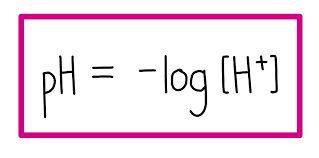

# Simulate the Water Quality and Monotring System

## Brief Explanation 
A simulation demonstrating how water quality is monitored and analyzed to support decision-making in water resource management. This project models parameters such as pH, turbidity, temperature, and other relevant indicators to assess water conditions over time.

## Related Equation and Formula
1. Dissolved Oxygen (DO) Saturation:

    **`As temperature increases, the solubility of oxygen in water decreases. Hence:`**

2. pH Definition:

    **`Indicates the concentration of hydrogen ions in the water; values below 7 are acidic, above 7 are basic.`**

    

3. Temperature Effect on DO:

    **`As temperature increases, the solubility of oxygen in water decreases. Hence:`**

4. Fish Behavior Index (FBI):

## 🧪 Parameters Simulated
- `pH level`
Measures the acidity/basicity of water. Optimal aquatic life thrives around pH 6.5–8.5.

- `Temperature (°C)`
Affects biological activity, chemical solubility, and oxygen levels.

- `Dissolved Oxygen (DO)`
Crucial for aquatic life. Levels below 5 mg/L are stressful to most fish.

- `Fish Behavior`
Simulated response of fish to changes in water quality — stress, migration, or normal activity depending on conditions.

## Results